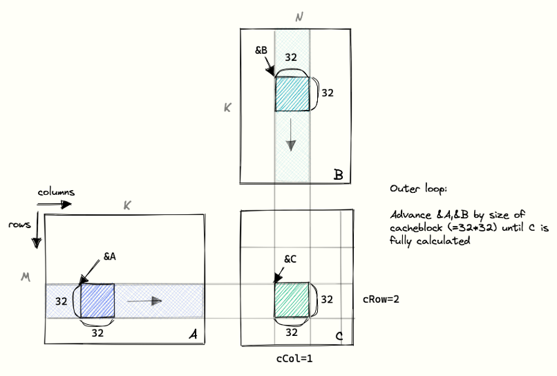

+++
date = '2025-02-25T16:05:58+08:00'
draft = true
title = 'CUDA MMA Optimization Node'
+++

Visit the [Hugo](https://gohugo.io) website!


# Kernel 3: Shared Memory Cache-Blocking




```C++
#include <algorithm>
#include <cassert>
#include <cstdio>
#include <cstdlib>
#include <cublas_v2.h>
#include <cuda_runtime.h>

#define CEIL_DIV(M, N) ((M) + (N)-1) / (N)

// gridDim stays the same
dim3 gridDim(CEIL_DIV(M, 32), CEIL_DIV(N, 32));
// make blockDim 1-dimensional, but don't change number of threads
dim3 blockDim(32 * 32);
sgemm_coalescing<<<gridDim, blockDim>>>(M, N, K, alpha, A, B, beta, C);


/*
Matrix Multiplication with Cache Blocking (32x32x32)
-----------------------------------------------------
- Matrix A (M x K), Matrix B (K x N), Matrix C (M x N)
- Cache blocking is used to improve memory locality.
- Each block of A (sub-matrix 6A) is of size 32x32.
- Each block of B (sub-matrix 6B) is of size 32x32.
- Each block of C (sub-matrix 6C) is of size 32x32.
- Outer loop iterates over C blocks, advancing A and B accordingly.

Looping strategy:
-----------------
- The outer loop moves in 32x32 blocks across matrix C.
- A and B are processed in sync with C.
- `cRow = 2`, `cCol = 1` indicates block position in C.
- The computation continues until all blocks in C are fully calculated.
*/

__global__ void sgemmCacheBlocking(int M, int N, int K, float alpha,
                                  const float *A, const float *B, float beta,
                                  float *C) {

    const int BM = 32;
    const int BN = 32;
    const int BK = 8;
    const int TM = 8;
    const uint cRow = blockIdx.y;
    const uint cCol = blockIdx.x;
    
    // advance pointers to the starting positions
    A += cRow * BM * K;                    // row=cRow, col=0
    B += cCol * BN;                        // row=0, col=cCol
    C += cRow * BM * N + cCol * BN; // row=cRow, col=cCol

    // thread map
    // warp 0:  [0,1]  [0,2]  ... [0,31]
    // ...
    // warp 31: [31,1] [31,2] ... [31,31]
    const int threadCol = threadIdx.x % BN;
    const int threadRow = threadIdx.x / BN;

    float tmp = 0.0;
    // the outer loop advances A along the columns and B along
    // the rows until we have fully calculated the result in C.
    for (int bkIdx = 0; bkIdx < K; bkIdx += BK) {
        // Have each thread load one of the elements in A & B from
        // global memory into shared memory.
        // Make the threadCol (=threadIdx.x) the consecutive index
        // to allow global memory access coalescing
        As[threadRow * BM + threadCol] = A[threadRow * K + threadCol];
        Bs[threadRow * BN + threadCol] = B[threadRow * N + threadCol];

        // block threads in this block until cache is fully populated
        __syncthreads();

        // advance pointers onto next chunk
        A += BM;
        B += BN * N;

        // execute the dotproduct on the currently cached block
        for (int dotIdx = 0; dotIdx < BK; ++dotIdx) {
            tmp += As[threadRow * BLOCKSIZE + dotIdx] * 
                    Bs[dotIdx * BLOCKSIZE + threadCol];
        }
        // need to sync again at the end, to avoid faster threads
        // fetching the next block into the cache before slower threads are done
        __syncthreads();
    }
    C[threadRow * N + threadCol] =
        alpha * tmp + beta * C[threadRow * N + threadCol];
}
```

# Kernel 4
```C++
__global__ void sgemm1DWarpTiling(int M, int N, int K, float alpha,
                                  const float *A, const float *B, float beta,
                                  float *C) {

  const int BM = 64;
  const int BN = 64;
  const int BK = 8;
  const int TM = 8;
  // If we flip x and y here we get ~30% less performance for large matrices.
  // The current, 30% faster configuration ensures that blocks with sequential
  // blockIDs access columns of B sequentially, while sharing the same row of A.
  // The slower configuration would share columns of A, but access into B would
  // be non-sequential. So the faster configuration has better spatial locality
  // and hence a greater L2 hit rate.
  const uint cRow = blockIdx.y;
  const uint cCol = blockIdx.x;

  const uint totalResultsBlocktile = BM * BN;
  // A thread is responsible for calculating TM elements in the blocktile
  const uint numThreadsBlocktile = totalResultsBlocktile / TM;

  // ResultsPerBlock / ResultsPerThread == ThreadsPerBlock
  assert(numThreadsBlocktile == blockDim.x);

  // each warp will calculate 32*TM elements, with 32 being the columnar dim.
  const int threadCol = threadIdx.x % BN;
  const int threadRow = threadIdx.x / BN;

  // allocate space for the current blocktile in SMEM
  __shared__ float As[BM * BK];
  __shared__ float Bs[BK * BN];

  // Move blocktile to beginning of A's row and B's column
  A += cRow * BM * K;
  B += cCol * BN;
  C += cRow * BM * N + cCol * BN;

  // todo: adjust this to each thread to load multiple entries and
  // better exploit the cache sizes
  assert(BM * BK == blockDim.x);
  assert(BN * BK == blockDim.x);
  const uint innerColA = threadIdx.x % BK; // warp-level GMEM coalescing
  const uint innerRowA = threadIdx.x / BK;
  const uint innerColB = threadIdx.x % BN; // warp-level GMEM coalescing
  const uint innerRowB = threadIdx.x / BN;

  // allocate thread-local cache for results in registerfile
  float threadResults[TM] = {0.0};

  // outer loop over block tiles
  for (uint bkIdx = 0; bkIdx < K; bkIdx += BK) {
    // populate the SMEM caches
    As[innerRowA * BK + innerColA] = A[innerRowA * K + innerColA];
    Bs[innerRowB * BN + innerColB] = B[innerRowB * N + innerColB];
    __syncthreads();

    // advance blocktile
    A += BK;
    B += BK * N;

    // calculate per-thread results
    for (uint dotIdx = 0; dotIdx < BK; ++dotIdx) {
      // we make the dotproduct loop the outside loop, which facilitates
      // reuse of the Bs entry, which we can cache in a tmp var.
      float tmp = Bs[dotIdx * BN + threadCol];
      for (uint resIdx = 0; resIdx < TM; ++resIdx) {
        threadResults[resIdx] +=
            As[(threadRow * TM + resIdx) * BK + dotIdx] * tmp;
      }
    }
    __syncthreads();
  }

  // write out the results
  for (uint resIdx = 0; resIdx < TM; ++resIdx) {
    C[(threadRow * TM + resIdx) * N + threadCol] =
        alpha * threadResults[resIdx] +
        beta * C[(threadRow * TM + resIdx) * N + threadCol];
  }
}
```